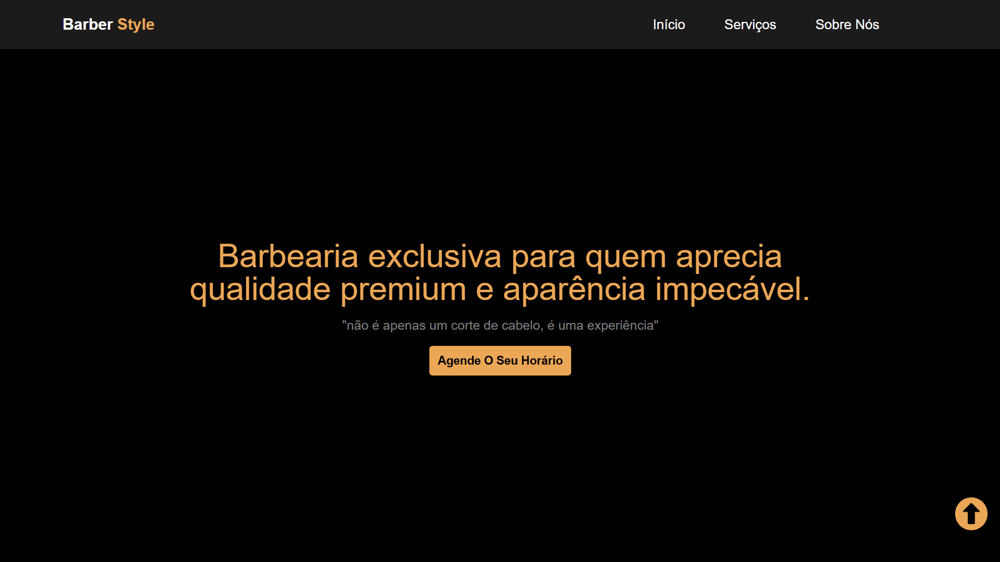

# 💈 Barber Style
Landing page de uma barbearia fictícia, desenvolvida como um dos meus primeiros projetos. Esse foi também o trabalho final do curso de **Programador de Computador**, onde apliquei os conhecimentos básicos de front-end.

## 🚀 Tecnologias Utilizadas

- **HTML** → Estruturação semântica de todo o conteúdo da página.  
- **CSS** → Estilização visual com foco em responsividade e boa apresentação em diferentes dispositivos.  
- **JavaScript** → Responsável pela navegação interativa, botão de rolagem para o topo e animações com a biblioteca ScrollReveal.


## 🖼️ Demonstração




## 🔗 Link para o Deploy

Você pode ver a versão final do projeto em [Aqui](https://calc-js-iota.vercel.app/).

## 🔧 Como Executar o Projeto

1. **Clone o repositório:**

   ```bash
   git clone https://github.com/KevinTereza/barber-style
   ```

2. **Acesse o diretório do projeto:**

    ```bash
    cd barber-style
    ```

3. **Abra o arquivo `index.html` para visualizar o projeto.**


## 📄 Licença

Este é um projeto de estudo, criado com fins de aprendizado e sem fins comerciais.

